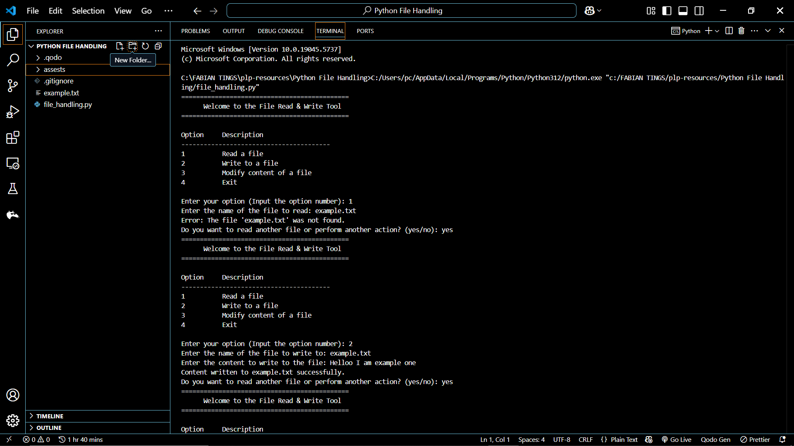
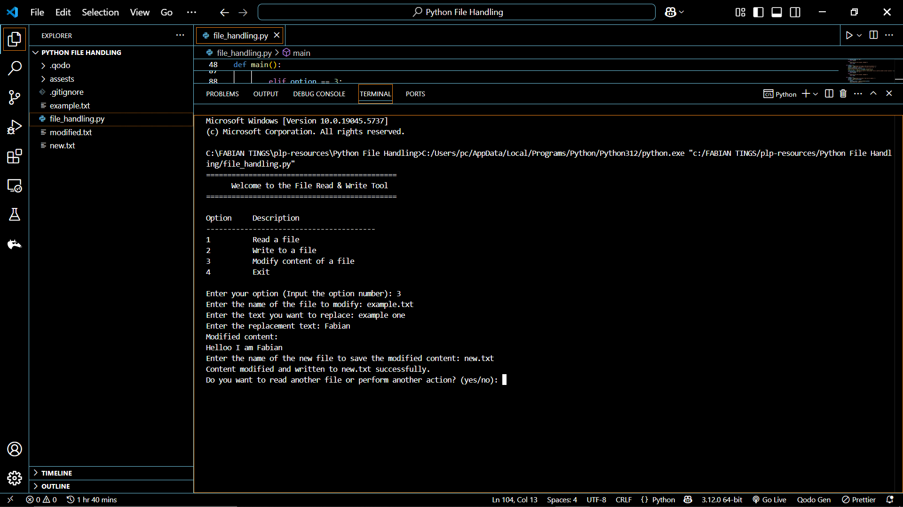

# 📝 File Read & Write Console Application

This is a Python-based console application that allows users to:
- Read content from a file
- Write content to a file
- Modify file content by replacing text
- Exit the program safely

---

## 📂 Features

| Option | Description                    |
|--------|--------------------------------|
| 1      | Read a file                    |
| 2      | Write to a file                |
| 3      | Modify content of a file       |
| 4      | Exit the program               |

---

## ▶️ How to Run

1. Make sure you have Python 3 installed.
2. Save the script as `main.py` or any filename you prefer.
3. Open your terminal or command prompt.
4. Run the script using:

```bash
    python main.py
```

## ✍️ How Modification Works
When selecting the Modify option:

- The user inputs the filename to open.

- The user specifies the word or phrase they want to replace.

- The user enters the replacement text.

- The modified content is shown and saved to a new file.

```
    Enter your option (Input the option number): 3
    Enter the name of the file to modify: example.txt
    Enter the text you want to replace: example one
    Enter the replacement text: Fabian. I am cooking Python😎😎
    Modified content:
    Helloo I am Fabian. I am cooking Python😎😎
    Enter the name of the new file to save the modified content: modified.txt
```
## Console Screenshots





## 👨‍💻 Author

**Fabian**  
*Simple console utility for file management using Python*
